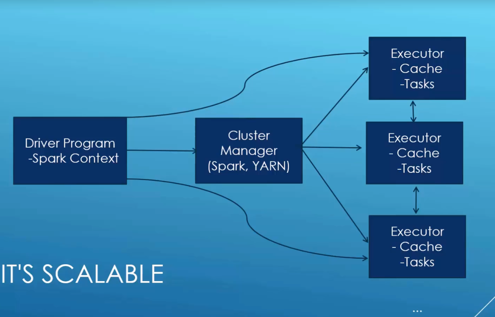
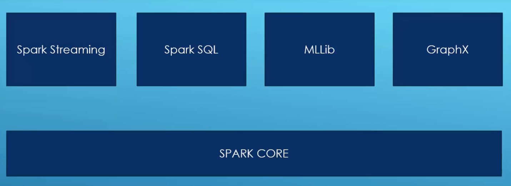

# Big Data with Apache Spark and Python

[](https://www.udemy.com/course/taming-big-data-with-apache-spark-hands-on)

## Sections

- [Set up](#set-up)
- [Course materials](#course-materials)
- [Test run](#test-run)
- [Introduction to Spark](#introduction-to-spark)
- [RDD](#rdd)
- [Run Spark on Cluster](#run-spark-on-cluster)
- [Trouble shooting](#trouble-shooting)
- [Spark SQL](#spark-sql)
- [MLLib](#mllib)


### Set up
[Follow this page for setting up spark-python](https://sundog-education.com/spark-python/)

[Apache Spark Installation](https://www.tutorialspoint.com/apache_spark/apache_spark_installation.htm)

[Anaconda 3](https://docs.anaconda.com/anaconda/install/)

### Course materials
[Python Script](http://media.sundog-soft.com/Udemy/SparkCourse.zip)

[Movie data](https://grouplens.org/datasets/movielens/)

### Test run
```bash
./run
```

### Introduction to Spark


- A fast and general engine for large-scale data processing
- 100x faster than Hadoop MapReduce in memory
- DAG engine optimizes workflows
- Code in Python, Java, Scala
- Built around the Resilient Distributed Dataset (RDD)




### RDD

- Resilient Distributed Dataset (RDD)
- Can create from JSON, CSV, sequence files, object files, compressed files JDBC etc.
- nums = parallelize([1,2,3,4])
- sc.textFile("s3n://path/file/"), hdfs://, file://
- hiveCtx=hiveContext(sc) rows=hiveCtx.sql("SELECT name, age, FROM users")
- operations: map, flatmap, filter, distinct, sample, union, intersection, subtract, cartesian
- functions: collect, count, countByValue, take, top, reduce ...
- SQL-style: join, rightOuterJoin, leftOuterJoin, cogroup, substractByKey
- groupByKey, combineByKey, lookup
- rdd=sc.parallelize([1,2,3,4]) -> rdd.map(lambda(x: x*x)) ->1,4,9,16
- rdd.take(n), rdd.cache()

### Run Spark on Cluster

- Set up AWS EC2 instance
- Partitioning `RDD.partionBy()`
    - trade off between #partitions vs #results
    - At least as many partitions as you have cores
    - partitionBy(100) is usually a reasonable place to start for large operations.
- cp data and script to s3
- sign up EMR and create EMR cluster
- connect EMR by ssh
- spark-submit -execute-memory 1g s3://dz33/spark/aws/movie-similarity_1m.py 260

### Trouble shooting

- standalone mode process log: localhost:4040
- `yarn logs --applicationID <app ID>`
- don't rely on fault tolerant
- use broadcast variables to share data outside of RDD

### Spark SQL
- Extends RDD as a DataFrame object
- DataFrames:
    - row objects
    - SQL queries
    - schema leading to efficient storage
    - read and write to JSON, HIVE, parquet
    - communicate with JDBC ODBC Tableau

```python
from pyspark.sql import SQLContext, Row
hiveContext = HiveContext(sc)
imputData = spark.read.json(dataFile)
inputData.createOrReplaceTempView("myStructuredStuff")
myResultDataFrame = hiveContext.sql('""'SELECT foo FROME bar ORDER BY foobar'""')
myResultDataFrame.show(n)
myResultDataFrame.select("someFiledName")
myResultDataFrame.filter(myResultDataFrame("someFiledName" > 200))
myResultDataFrame.groupBy(myResultDataFrame("someFiledName"))
myResultDataFrame.rdd().map(function)
```

### MLLib
- basic statistics, Ch-squared, pearson, spearman, variance
- Linear regression
- Vector machines, naive bayes classifier, decision trees, KM clustering, PCA
- Alternating Least squares (ALS), ->Netflix
- data types: vector, labeledPoint, rating


